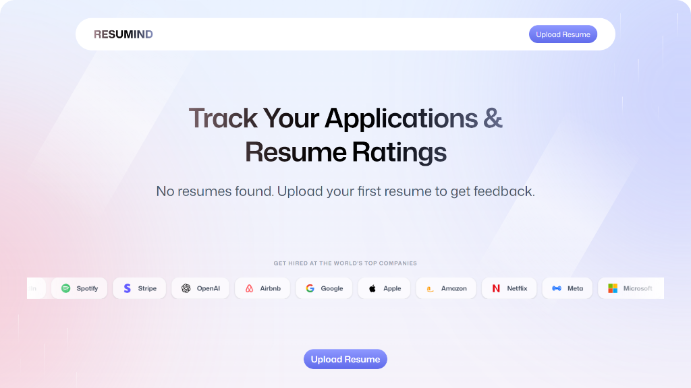
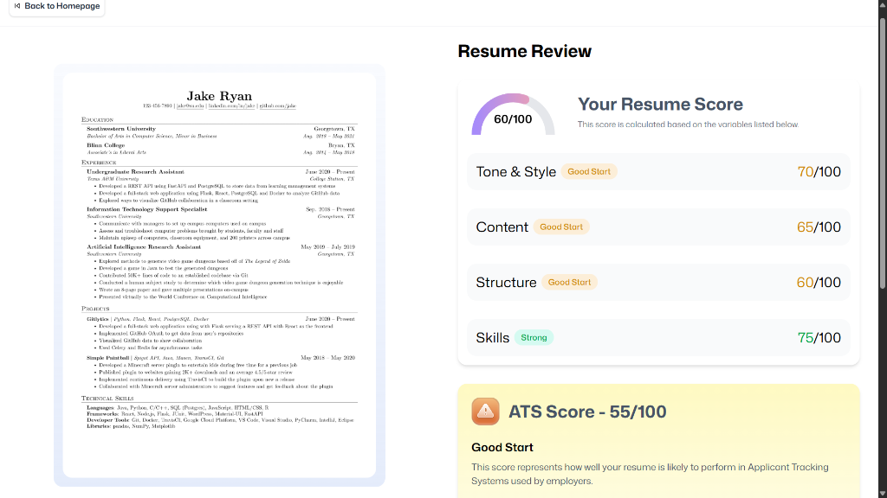
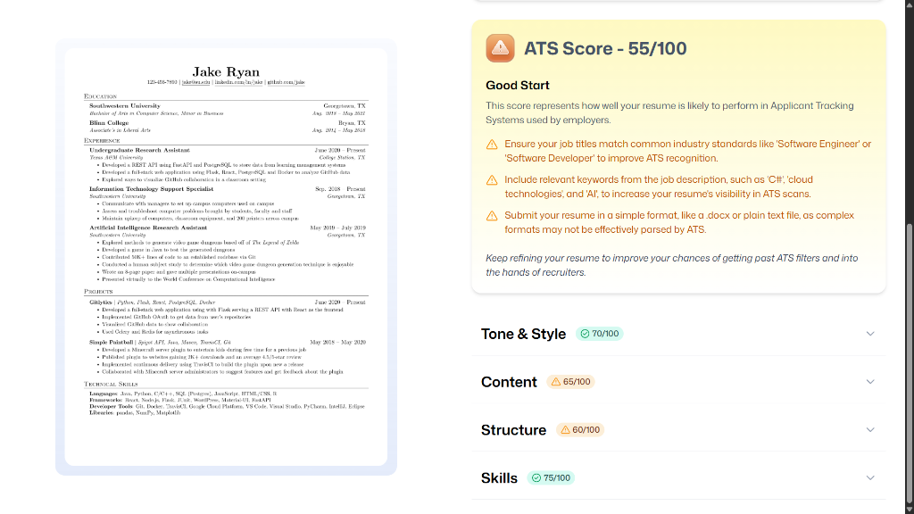
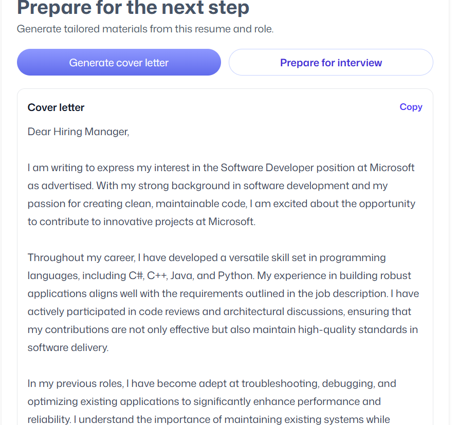
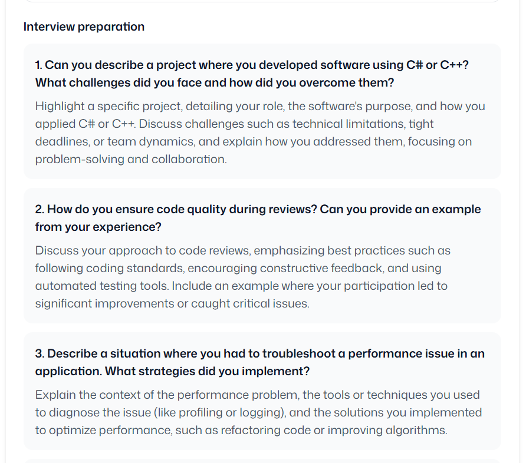

# RESUMIND - AI Resume Analyzer 📄✨

An AI-powered resume analyzer and career preparation web application built with **React 19**, **React Router v7**, and **Puter.js**. RESUMIND helps job seekers analyze their resumes against specific job descriptions, calculate ATS match scores, generate tailored cover letters, and prepare for interviews—all running seamlessly in the browser.

---

## 🌟 Key Features & Feature Highlights

### 1. 🔒 Serverless Authentication
Instant, seamless authentication powered by **Puter.js**. No backend server setup or database management required—users can securely log in and manage their session directly within the browser.


---

### 2. 📊 Application & Resume Tracker Dashboard
Track all your resumes, applications, and ATS performance scores from a centralized dashboard. Easily view your evaluation history and upload new resumes for instant scoring.



---

### 3. 🎯 Smart ATS Feedback & Job Matching
Input any job title, company name, and job description, then upload your resume (PDF/DOCX). The AI parses your resume, compares it with the target role, and provides:
- **ATS Match Score**
- **Detailed Skill Gap Analysis**
- **Actionable Formatting & Content Recommendations**


---

### 4. 📈 In-Depth Resume Review & ATS Score Analysis
Get a comprehensive analysis of your resume with detailed category-based scoring and actionable ATS optimization feedback:
- **Comprehensive Resume Scoring**: Detailed ratings for Tone & Style, Content, Structure, and Skills.
- **ATS Compatibility Scan**: Detect formatting issues, title alignment, and keyword gaps to maximize ATS readability.
- **Interactive Breakdown**: Expandable sections providing precise tips and guidance for resume refinement.





---

### 5. ✉️ AI-Powered Cover Letter Generator
Effortlessly generate highly customized, professional cover letters tailored specifically to the target company and job description based on your resume's experience. Includes a 1-click copy functionality.



---

### 6. 💡 Targeted Interview Preparation Assistant
Prepare for interviews with confidence. The application generates customized interview questions (technical, behavioral, and scenario-based) tailored specifically to your resume background and the target role, complete with strategy guidance for each response.



---

## 🛠️ Tech Stack

- **Framework**: [React 19](https://react.dev/) + [React Router v7](https://reactrouter.com/)
- **Cloud, Auth & AI Engine**: [Puter.js](https://puter.com/) (Serverless Cloud Storage, Auth, and Client-Side AI LLM execution)
- **Styling**: [Tailwind CSS v4](https://tailwindcss.com/) + Custom Glassmorphism UI
- **Language**: [TypeScript](https://www.typescriptlang.org/)
- **Build Tool**: [Vite](https://vitejs.dev/)
- **State Management**: [Zustand](https://zustand-demo.pmnd.rs/)
- **PDF Parsing**: `pdfjs-dist` + `react-dropzone`

---

## 🚀 Getting Started

### Prerequisites
- **Node.js**: v18.0.0 or higher
- **npm** or **pnpm** or **yarn**

### Installation

1. **Clone the repository**:
   ```bash
   git clone https://github.com/AyushRaj-129/AI-Resume-Analyzer-Portfolio.git
   cd AI-Resume-Analyzer-Portfolio
   ```

2. **Install dependencies**:
   ```bash
   npm install
   ```

3. **Start the development server**:
   ```bash
   npm run dev
   ```

4. **Open in browser**:
   Navigate to `http://localhost:5000` (or the port shown in your terminal).

> **Note**: No API keys or backend environment setup are required! Puter.js handles authentication and AI processing natively in the browser environment.

---

## 📂 Project Structure

```text
ai-resume-analyzer/
├── app/
│   ├── components/     # Reusable UI components (Navbar, ResumeCard, Dropzone, etc.)
│   ├── lib/            # Utilities, Puter.js integrations, and PDF parser helpers
│   ├── routes/         # React Router v7 routes (home, auth, upload, resume details)
│   ├── app.css         # Global CSS & Tailwind imports
│   └── root.tsx        # Application root layout
├── screenshots/        # Feature screenshots for documentation
├── public/             # Static assets and icons
├── package.json        # Dependencies and scripts
├── vite.config.ts      # Vite configuration
└── tsconfig.json       # TypeScript configuration
```
---

